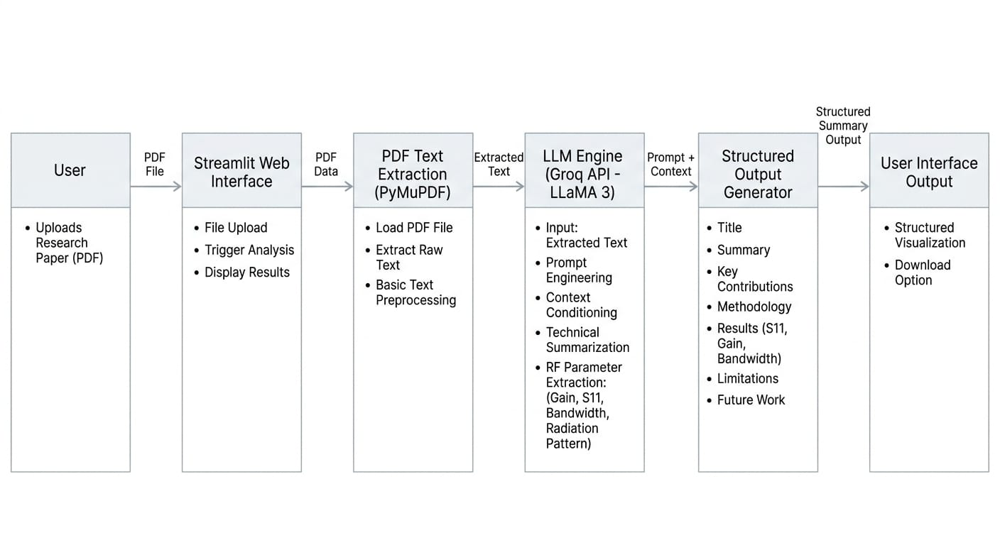

# 🧠 AI Research Assistant

An AI-powered system to analyze and summarize research papers with structured outputs.

---

## 🚀 Features
- Upload research paper (PDF)
- Extract text using PyMuPDF
- Generate structured summary using LLM (Groq API - LLaMA 3)
- RF-focused analysis (Gain, S11, Bandwidth, Radiation)
- Clean UI using Streamlit
- Downloadable output

---

## 🏗️ Architecture
See architecture diagram below:

---

## ⚙️ Tech Stack
- Python
- Streamlit
- PyMuPDF
- Groq API (LLaMA 3)

---

## 📊 Output Format
- Title
- Summary
- Key Contributions
- Methodology
- Results
- Limitations
- Future Work

---

## 🌐 Live App
(put your streamlit link here)

---

## 👨‍💻 Author
Safalya Mohod
